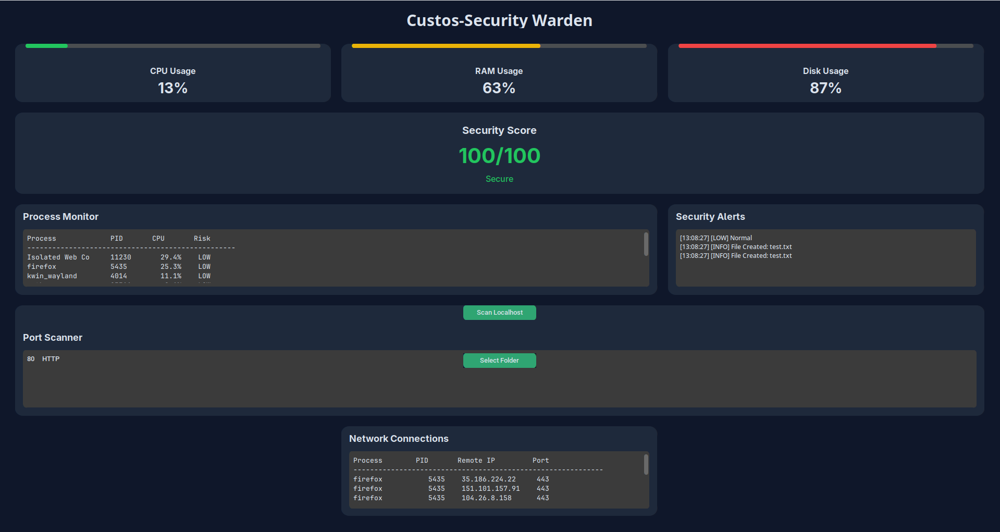

# Custos - Security Warden

## Overview

Custos is a lightweight cybersecurity dashboard for Linux that provides real-time system monitoring, process analysis, file integrity monitoring, port scanning, and network connection visibility.

## Features

- Real-time CPU, RAM, and Disk monitoring
- Security score calculation
- Process monitoring and risk classification
- File integrity monitoring
- Security alerts system
- Localhost port scanning
- Active network connection monitoring

## Technologies

- Python
- CustomTkinter
- psutil
- socket
- hashlib

## Installation

...

## Screenshots

...

## Future Improvements

- PDF security reports
- Threat intelligence integration
- VirusTotal API support
- Suspicious IP detection
